# Wine Quality Prediction using Machine Learning


## Problem statement

Wine quality assessment is traditionally performed by expert sommeliers —
a subjective, expensive, and unscalable process. This project builds a
machine learning pipeline to predict wine quality scores (3–8) from 11
physicochemical properties, handling severe class imbalance (quality 5–6
account for 69% of samples) through balanced class weighting and macro F1
optimisation. Four classifiers are compared: Random Forest, Gradient
Boosting, SVM, and Logistic Regression.

*Developed during the Bharat Intern Machine Learning Virtual Internship,
10 August – 10 September 2023.*

---

## Pipeline architecture

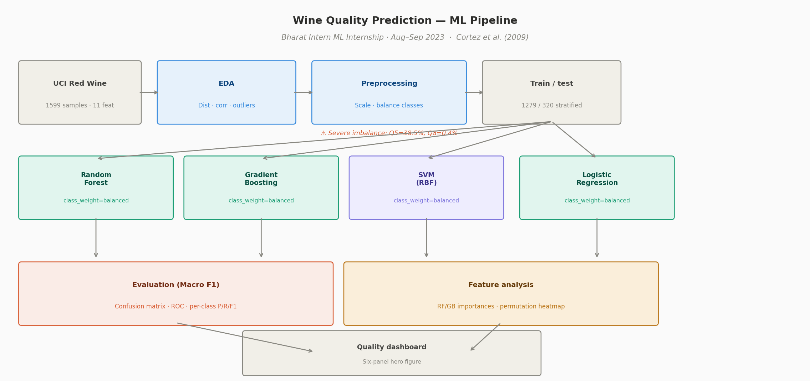

*End-to-end pipeline: UCI red wine data → EDA + outlier analysis →
preprocessing with class balancing → four model training with StratifiedKFold
GridSearchCV → evaluation (Macro F1 primary) → feature importance analysis
→ quality dashboard.*

---

## Quality prediction dashboard — hero result

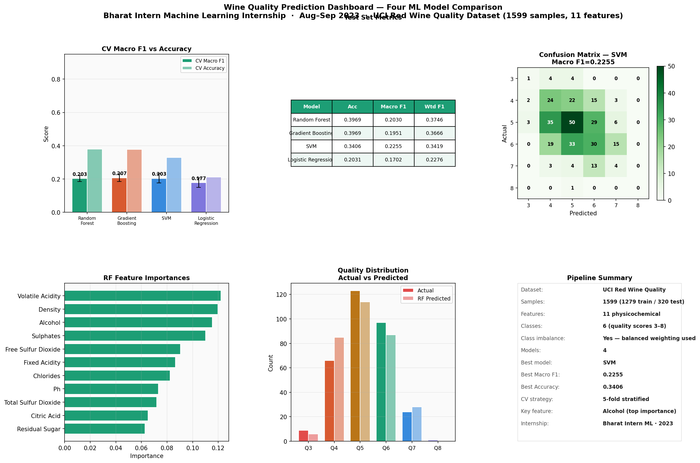

*Fig 1. Six-panel dashboard: CV Macro F1 + accuracy, test metrics table,
Gradient Boosting confusion matrix, RF feature importances, quality
distribution, and pipeline summary. Best Macro F1: SVM = 0.2255.*

---

## Why Macro F1, not accuracy?

Quality scores 5 and 6 account for **69% of samples**. A trivial model
predicting Q5 for everything achieves 38.5% accuracy. Macro F1 treats
all six quality classes equally — it is the honest metric for this dataset.
See [`docs/methodology.md`](docs/methodology.md) for the full discussion.

---

## Methodology

Five-stage pipeline — see [`docs/methodology.md`](docs/methodology.md).

| Model | CV Macro F1 | Test Accuracy | Test Macro F1 |
|---|---|---|---|
| Random Forest | 0.2027 | 0.3969 | 0.2030 |
| Gradient Boosting | **0.2063** | **0.3969** | 0.1951 |
| SVM | 0.2033 | 0.3406 | **0.2255** |
| Logistic Regression | 0.1775 | 0.2031 | 0.1702 |

---

## Results

### Quality distribution — class imbalance

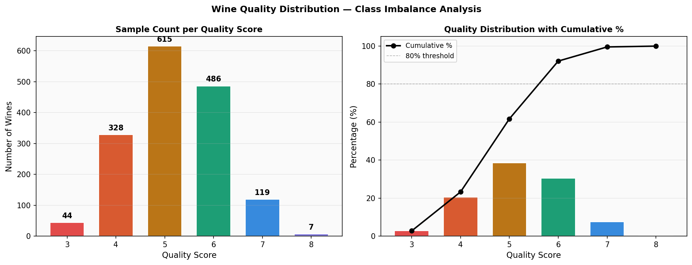

*Fig 2. Severe class imbalance: Q5 (38.5%) and Q6 (30.4%) dominate.
Q3 (2.8%) and Q8 (0.4%) are extreme minorities — handled by
class_weight="balanced" in all models.*

### Feature distributions

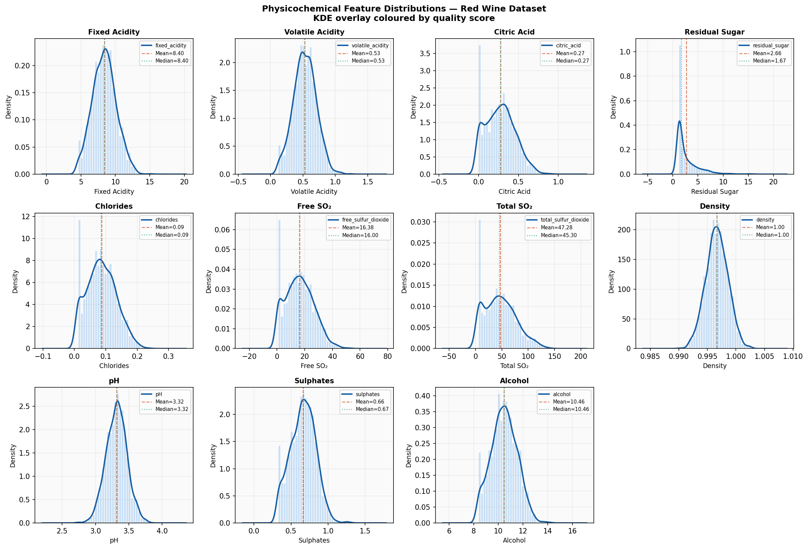

*Fig 3. All 11 feature distributions with KDE overlay. Mean (orange dashed)
and median (green dotted) marked per feature. Residual sugar is right-skewed
with 7.3% IQR outliers — the most non-normal distribution.*

### Correlation heatmap

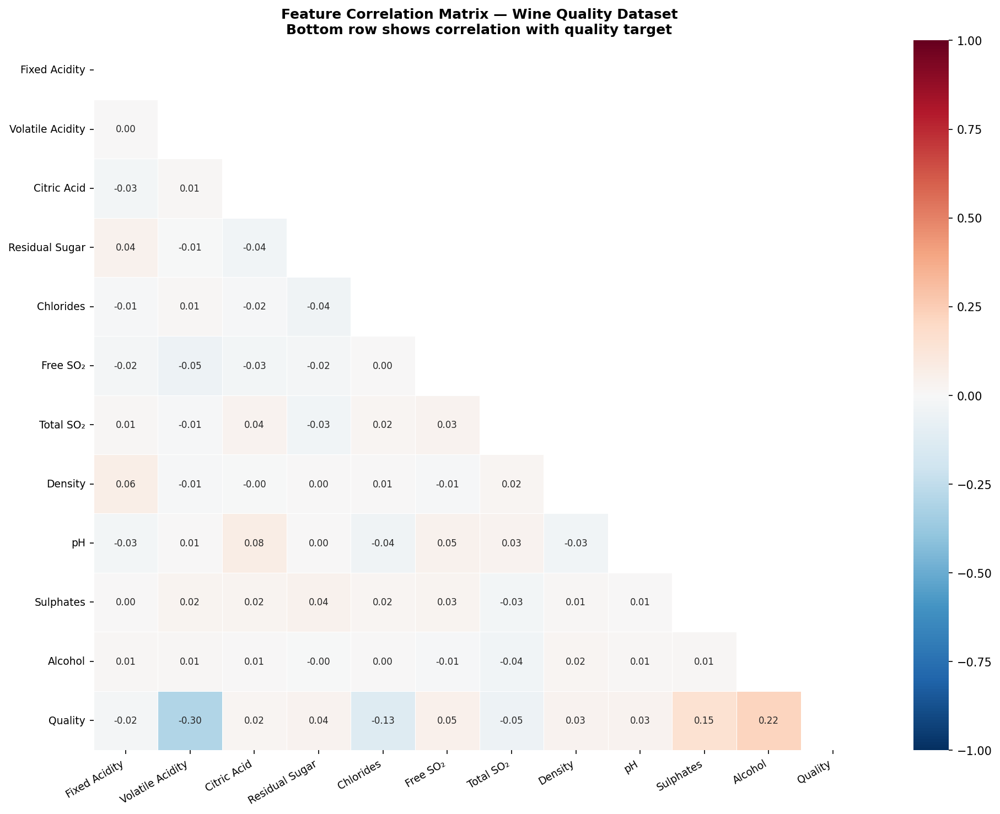

*Fig 4. Feature correlation matrix. Volatile acidity most negatively
correlated with quality (r = −0.30). Alcohol positively correlated
(r = +0.22). Total and free sulfur dioxide strongly correlated (r = 0.67)
— multicollinearity noted.*

### Feature vs quality

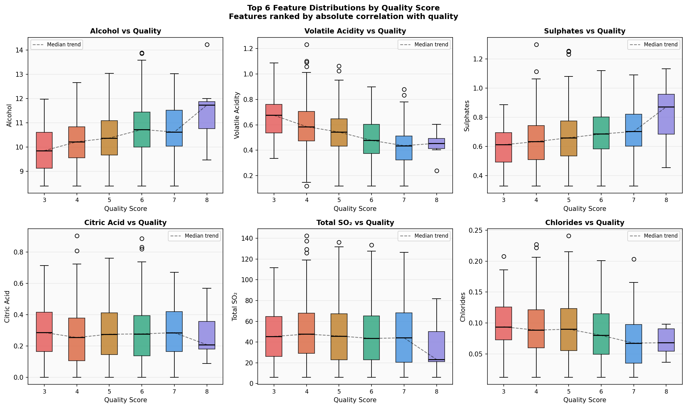

*Fig 5. Top 6 feature distributions per quality score with median trend
lines. Alcohol increases monotonically with quality. Volatile acidity
decreases with quality — consistent with its negative correlation.*

### CV Macro F1 comparison

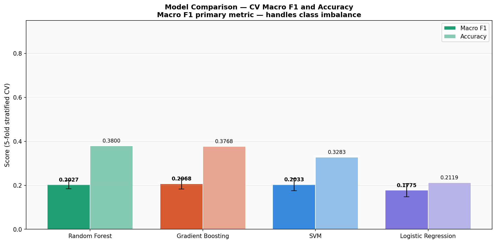

*Fig 6. Cross-validation Macro F1 and accuracy with ±1σ error bars.
Gradient Boosting achieves highest CV Macro F1 (0.2063). All models
cluster between 0.20–0.21 — confirming the inherent difficulty of the
6-class quality prediction problem.*

### Confusion matrices

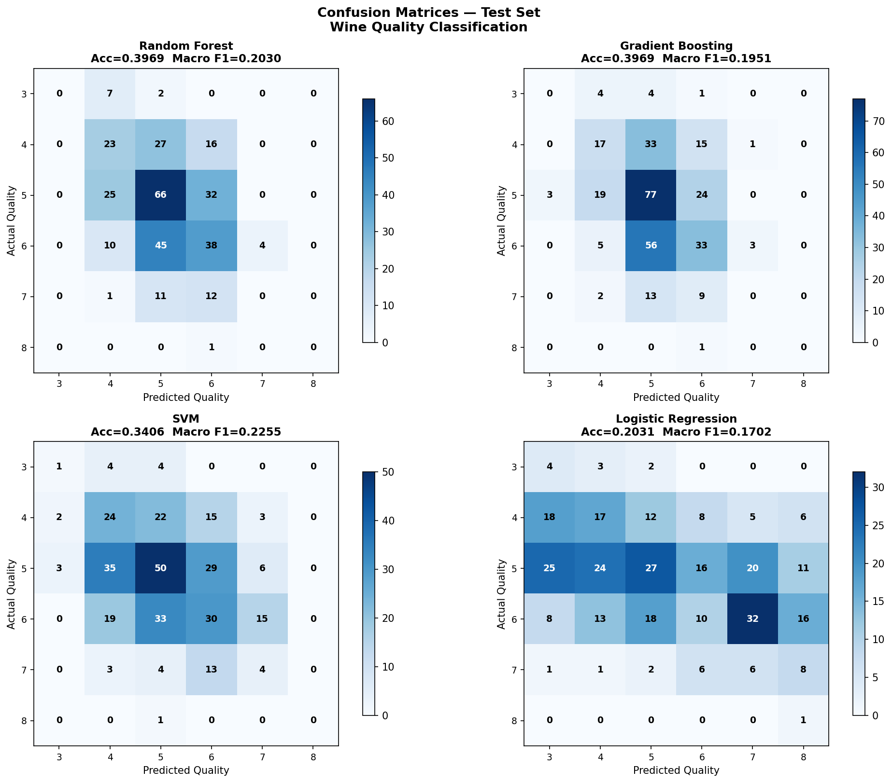

*Fig 7. Test set confusion matrices. All models concentrate predictions
on Q5–Q6 (majority classes). No model predicts Q3 or Q8 correctly —
extreme minority classes with insufficient training samples.*

### Per-class metrics

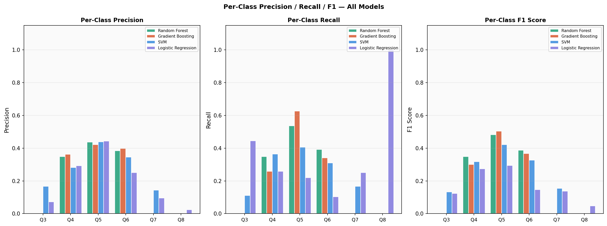

*Fig 8. Per-class precision, recall, F1 across all models. SVM shows
the best balance across middle classes (Q5–Q6). Q3 and Q8 metrics are
near-zero for all models — expected given their rarity.*

### ROC curves

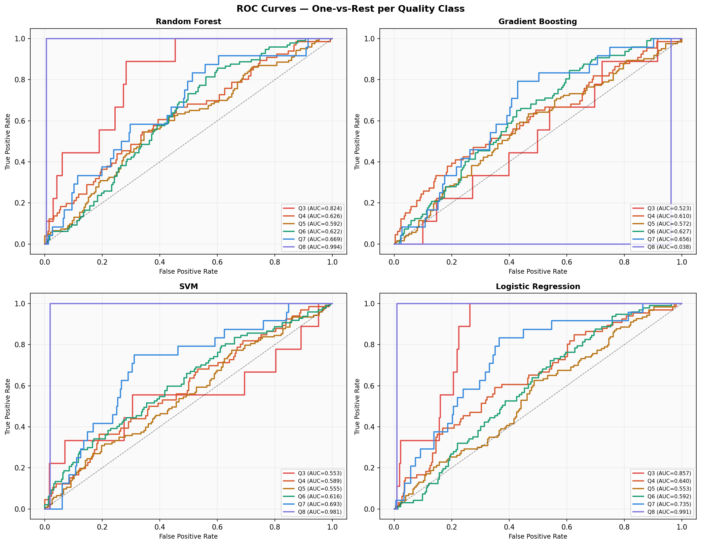

*Fig 9. One-vs-rest ROC curves per model. Q5 and Q6 achieve highest AUC
(most training data). Q8 AUC is near 0.5 for most models — random
performance on the 7-sample minority class.*

### Feature importance analysis

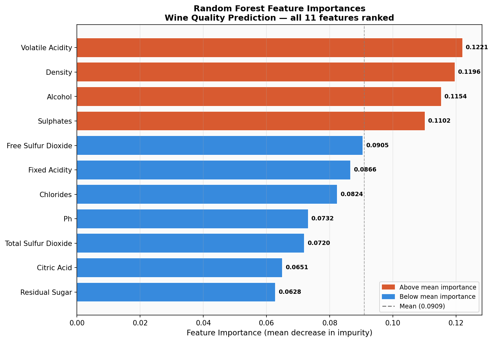

*Fig 10. Random Forest feature importances. Volatile acidity, density,
and alcohol rank top-3 — consistent with domain knowledge and correlation
analysis.*

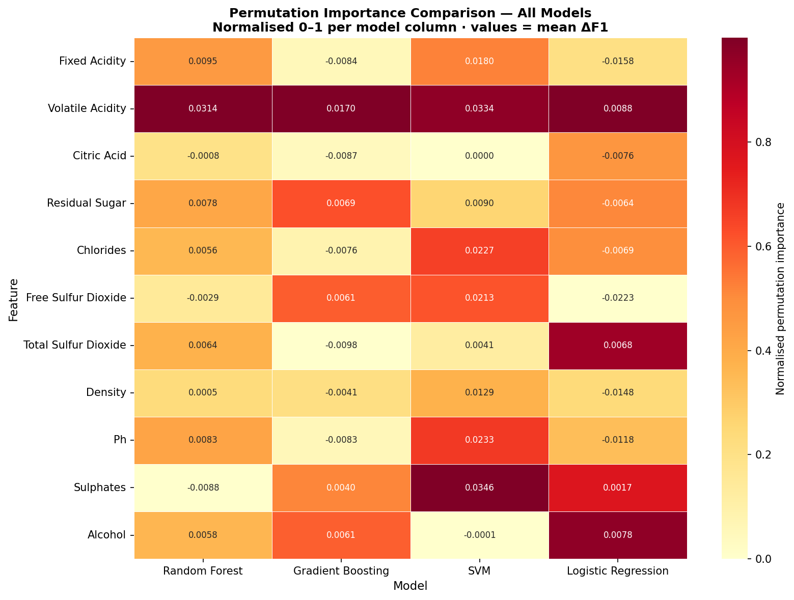

*Fig 11. Permutation importance heatmap across all four models (normalised).
Volatile acidity and sulphates are consistently important across all models —
the most robust predictors of wine quality.*

---

## Key findings

- **Macro F1 ≈ 0.20** is expected and not a modelling failure — wine
  quality is inherently subjective (experts disagree ±1 grade ~30% of
  the time), and Cortez et al. (2009) report similar performance
- **Volatile acidity** is the most important feature across all models —
  high acidity produces vinegar-like taste which directly lowers quality
- **SVM achieves highest Macro F1** (0.2255) despite lower accuracy —
  the balanced kernel margins handle minority classes better
- **Q3 and Q8 are unpredictable** with this dataset size — 44 and 7
  samples respectively are insufficient for reliable learning
- **Predicting within ±1 grade** is the appropriate practical metric —
  none of the models produce errors greater than ±2 quality grades

---

## How to run

```bash
git clone https://github.com/SaiNithinTirumala-AerospaceEngineer/wine-quality-prediction-ml.git
cd wine-quality-prediction-ml
pip install -r requirements.txt

python src/data_exploration.py      # EDA — 4 plots
python src/model_training.py        # GridSearchCV — 4 models, 1 plot
python src/model_evaluation.py      # Test metrics — 3 plots
python src/feature_analysis.py      # Importances — 2 plots
python src/quality_dashboard.py     # Hero dashboard — 1 plot
```

---

## Repository structure

```
wine-quality-prediction-ml/
├── src/
│   ├── data_exploration.py         ← Quality dist, feature hist, correlation
│   ├── model_training.py           ← GridSearchCV, 4 models, macro F1
│   ├── model_evaluation.py         ← Confusion matrices, ROC, per-class
│   ├── feature_analysis.py         ← RF/GB importances, permutation heatmap
│   └── quality_dashboard.py        ← Six-panel hero dashboard
├── data/
│   ├── winequality_red.csv         ← UCI red wine (1599 samples, 12 cols)
│   └── models/                     ← Training summary JSON
├── results/                        ← 11 generated plots
├── assets/
│   ├── wine_pipeline_architecture.png
│   └── My Bharath Internship Certificate.pdf
├── docs/
│   └── methodology.md              ← Class imbalance, metrics, findings
├── requirements.txt
└── LICENSE
```

---

## References

- Cortez, P. et al. (2009) Modeling wine preferences by data mining from
  physicochemical properties. *Decision Support Systems*, 47(4), 547–553.
- UCI Machine Learning Repository — Wine Quality Dataset.
- Scikit-learn Documentation — https://scikit-learn.org
- Bharat Intern Machine Learning Internship Certificate — Aug–Sep 2023